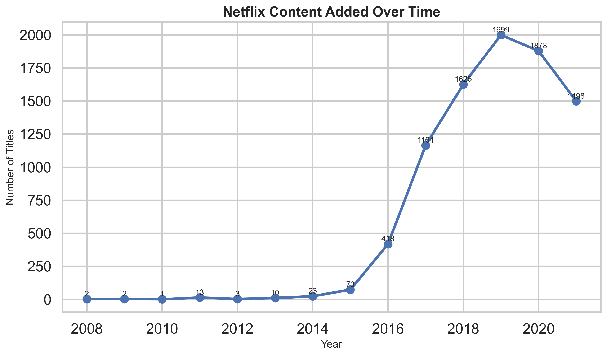
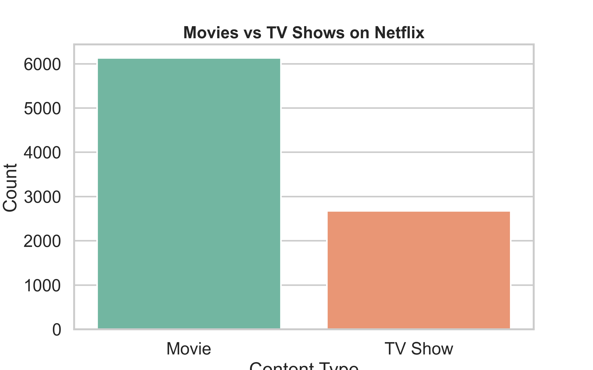
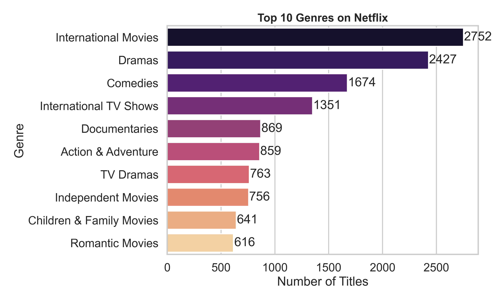
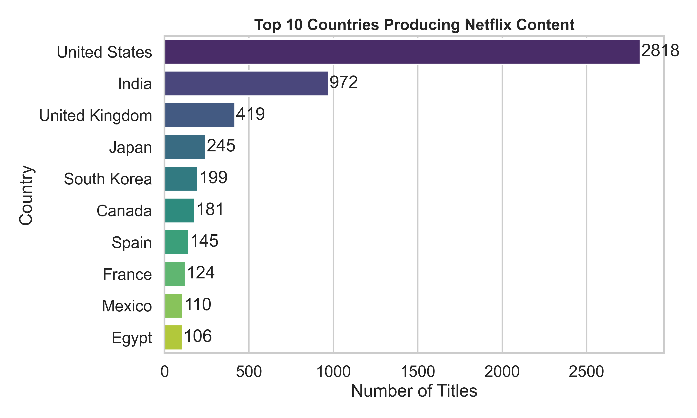
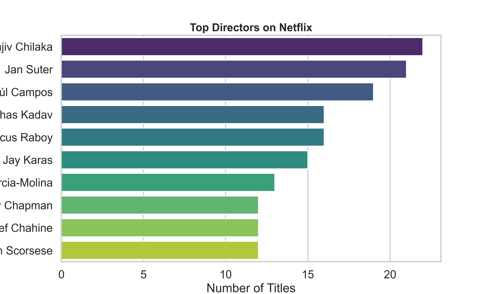
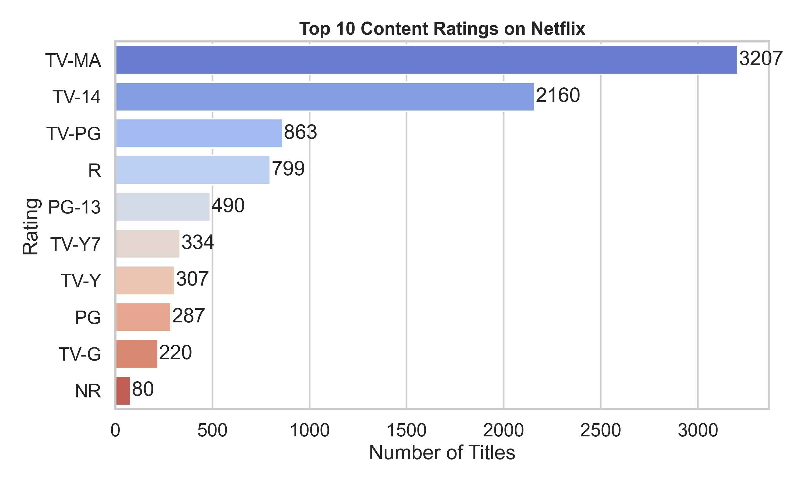
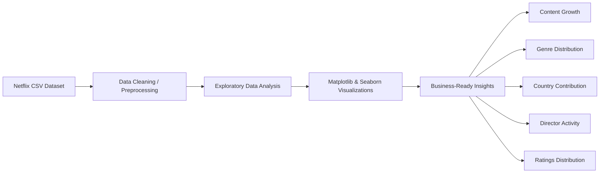

# Netflix Content Analytics Platform

<p align="center">
  A data analytics case study using Python, Pandas, Matplotlib, and Seaborn to analyze Netflix Movies and TV Shows and uncover trends in content growth, genre dominance, global production, ratings, and creator activity.
</p>

<p align="center">
  
  
  
  
  
</p>

---

## Project Overview

This project analyzes the Netflix Movies and TV Shows dataset to understand how the platform's catalog has evolved over time. The analysis explores content growth, Movies vs TV Shows distribution, genre popularity, country contribution, ratings, and director activity.

The goal is to transform raw entertainment metadata into clear insights that communicate Netflix's catalog strategy and global content patterns.

---

## Problem Statement

Streaming platforms generate large content catalogs, but raw title metadata does not immediately explain platform strategy. This project answers:

- How has Netflix expanded its content library over time?
- Are Movies or TV Shows more dominant in the catalog?
- Which genres appear most frequently?
- Which countries contribute the most Netflix content?
- Which directors have the highest number of titles?
- What does the ratings distribution suggest about audience targeting?

---

## Key Takeaways

- Netflix content growth accelerated sharply after 2015, with the strongest expansion between 2016 and 2019.
- Movies make up a significantly larger share of the catalog than TV Shows.
- International Movies, Dramas, and Comedies are among the most represented genres.
- The United States contributes the highest number of titles, followed by India and the United Kingdom.
- Several directors appear multiple times, suggesting recurring creator partnerships.
- Ratings trends provide insight into how Netflix balances mainstream, family, teen, and mature content.

---

## Business Impact

This analysis translates Netflix catalog metadata into decision-ready insights that can support:

- **Content Strategy:** Identifying when Netflix expanded most aggressively and which content types dominate the catalog.
- **Market Expansion:** Highlighting top contributing countries and where global production is most concentrated.
- **Audience Targeting:** Using ratings and genre patterns to understand how the catalog is positioned for viewer segments.

---

## Tools & Skills

- Python
- Pandas
- Matplotlib
- Seaborn
- Jupyter Notebook
- Data Cleaning
- Exploratory Data Analysis
- Data Visualization
- Insight Communication

---

## Dataset

**Dataset:** Netflix Movies & TV Shows Dataset  
**Source:** [Kaggle - Netflix Shows Dataset](https://www.kaggle.com/datasets/shivamb/netflix-shows)  
**Approximate Size:** 8,800+ titles

Key fields used in the analysis:

- `show_id`
- `type`
- `title`
- `director`
- `cast`
- `country`
- `date_added`
- `release_year`
- `rating`
- `duration`
- `listed_in`

---

## Data Preparation & Methods

The dataset was cleaned and processed using Pandas before analysis. Main steps included:

- Removed or handled missing and inconsistent values
- Converted date fields for time-based analysis
- Aggregated titles by year to analyze growth trends
- Grouped genres and countries to identify dominant categories
- Counted Movies vs TV Shows distribution
- Analyzed director frequency and rating distribution
- Generated visualizations using Matplotlib and Seaborn

---

## Visual Insights

### Content Growth Over Time



Netflix's catalog expanded rapidly after 2015 and peaked around 2019, suggesting a major platform expansion period.

### Movies vs TV Shows Distribution



Movies clearly dominate the Netflix catalog, showing that film content makes up the majority of available titles.

### Top Genres on Netflix



International Movies, Dramas, and Comedies appear most frequently, highlighting Netflix's focus on broad and globally appealing categories.

### Top Countries Producing Netflix Content



The United States leads content production by a wide margin, followed by India and the United Kingdom.

### Top Directors on Netflix



Several directors contribute multiple titles, showing recurring creator presence within the Netflix catalog.

### Ratings Distribution



Ratings analysis helps explain how Netflix content is distributed across different audience groups and maturity levels.

---

## Data Analytics Pipeline

```text
Dataset -> Data Cleaning -> Exploratory Data Analysis -> Visualization -> Insights
```

---

## Architecture



---

## Project Website

This repository also includes a responsive project portfolio webpage:

- `index.html`
- `style.css`

Direct project links:

- [View Project Code](https://github.com/bindhusaahithi/Netflix-Analysis)
- [View Notebook](Notebook/Netflix_Analysis.ipynb)
- [View Dataset](https://www.kaggle.com/datasets/shivamb/netflix-shows)

The webpage presents the project as a recruiter-friendly case study with overview, key findings, visual analysis, workflow, architecture, and run instructions.

---

## Quick Start

### Prerequisites

- Python 3.10+
- Jupyter Notebook

Install the required libraries:

```bash
pip install -r requirements.txt
```

If you prefer installing manually:

```bash
pip install pandas matplotlib seaborn notebook
```

### Clone the Repository

```bash
git clone https://github.com/bindhusaahithi/Netflix-Analysis.git
cd Netflix-Analysis
```

### Run the Notebook

```bash
jupyter notebook Notebook/Netflix_Analysis.ipynb
```

Run all cells to reproduce the analysis and visualizations.

---

## Project Structure

```text
Netflix-Analysis/
├── Data/
│   └── netflix_titles.csv
├── Notebook/
│   └── Netflix_Analysis.ipynb
├── visuals/
│   ├── content_growth.png
│   ├── movies_vs_tvshows.png
│   ├── top_countries.png
│   ├── top_directors.png
│   ├── top_genres.png
│   └── top_ratings.png
├── index.html
├── requirements.txt
├── style.css
└── README.md
```

---

## Future Improvements

- Build an interactive dashboard using Streamlit or Power BI
- Add deeper analysis by release year and country-genre combinations
- Perform text analysis on Netflix descriptions
- Train a recommendation or classification model using content metadata
- Compare Netflix content patterns with other streaming platforms

---

## Final Conclusion

This analysis shows that Netflix's catalog expanded aggressively in the late 2010s, with Movies remaining the dominant content type. The dataset also reflects strong international breadth, with major contributions from the United States, India, and the United Kingdom. Overall, the project demonstrates how exploratory data analysis can reveal meaningful patterns in content strategy, audience targeting, and global production trends.

---

## Author

**Bindhu Saahithi**  
Master's in Data Science

GitHub: [bindhusaahithi](https://github.com/bindhusaahithi)
