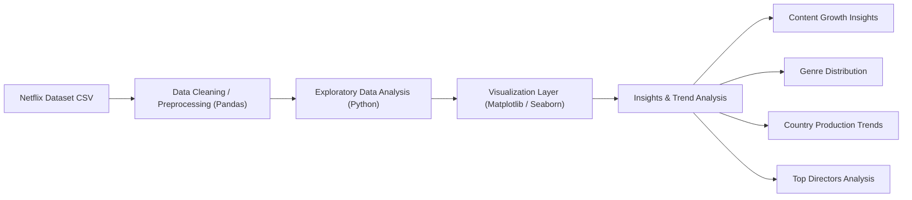

# Netflix Content Analytics Platform

Explore content trends, genre dominance, and global production insights using data analytics on the Netflix Movies and TV Shows dataset.

---

# Project Overview

This project analyzes the **Netflix Movies and TV Shows dataset** to uncover insights about streaming content trends.

The analysis focuses on understanding:

- How Netflix expanded its content library over time  
- The distribution of Movies vs TV Shows  
- The most popular genres on Netflix  
- Countries producing the most Netflix content  
- Directors contributing the most titles  

Using **Python, Pandas, Matplotlib, and Seaborn**, this project demonstrates how exploratory data analysis can transform raw datasets into meaningful insights.

---

# Key Takeaways

• Netflix experienced rapid content expansion after 2016, indicating aggressive platform growth.  
• Movies dominate the platform, making up roughly twice as many titles as TV shows.  
• International Movies and Dramas are the most common genres in the catalog.  
• The United States leads content production, followed by India and the United Kingdom.  
• Several directors collaborate repeatedly with Netflix, contributing multiple titles.

---

# Why This Analysis Matters

Streaming platforms generate massive content datasets that can reveal strategic patterns when analyzed effectively. This project demonstrates how data analysis can be used to:

Track platform growth over time
Compare the balance between Movies and TV Shows
Identify dominant genres in the catalog
Understand which countries contribute the most content
Discover repeat contributors such as directors
Interpret how Netflix positions content for different audience groups

---

# Project Objectives

- Analyze the growth of Netflix content over the years  
- Compare Movies vs TV Shows distribution  
- Identify the most popular genres  
- Discover top contributing countries  
- Find directors with the most titles on Netflix  

---

# Tools & Libraries

- Python  
- Pandas  
- Matplotlib  
- Seaborn  
- Jupyter Notebook  

---

# Dataset

Netflix Movies & TV Shows dataset.

Source:  
https://www.kaggle.com/datasets/shivamb/netflix-shows

---

## Data Preparation & Methods

The dataset was cleaned and processed using Pandas:

• Removed missing or inconsistent values  
• Converted date fields for time-based analysis  
• Aggregated titles by year to analyze growth trends  
• Grouped genres and countries to identify dominant categories  
• Generated visualizations using Matplotlib and Seaborn

---

# Key Insights

## Content Growth on Netflix

Netflix content increased significantly after 2015, indicating aggressive platform expansion.

---

## Movies vs TV Shows Distribution

Movies dominate the Netflix catalog, making up the majority of titles.

---

## Top Genres on Netflix

International Movies and Dramas appear most frequently in the dataset.

---

## Top Countries Producing Netflix Content

The United States leads content production, followed by India and the United Kingdom.

---

## Top Directors on Netflix

Several directors contribute multiple titles, showing strong collaborations with Netflix.

---

# Data Analytics Pipeline

The project follows a simple data analytics workflow.

Dataset → Data Cleaning → Exploratory Analysis → Visualization → Insights

---

# Architecture

---

# What You Can Do With This Project

### Content Trend Analysis

- Analyze Netflix content growth across years  
- Identify expansion patterns in the streaming platform

### Genre Analysis

- Discover dominant genres on Netflix  
- Explore content category distributions

### Geographic Analysis

- Identify which countries contribute the most titles  
- Analyze global production patterns

### Creator Analysis

- Identify directors producing the most Netflix content

---

# Quick Start

## Prerequisites

Python 3.8+

Install required libraries:

pip install pandas matplotlib seaborn

---

## Clone Repository

git clone https://github.com/bindhusaahithi/Netflix-Analysis.git

cd Netflix-Analysis

---

## Run the Analysis

Open the notebook:

jupyter notebook Netflix_Analysis.ipynb

Run all cells to reproduce the analysis and visualizations.

---

# Project Structure

Netflix-Analysis

├── data  
│   └── netflix_titles.csv  

├── notebooks  
│   └── Netflix_Analysis.ipynb  

├── visuals  
│   ├── content_growth.png  
│   ├── movies_vs_tvshows.png  
│   ├── top_genres.png  
│   ├── top_countries.png  
│   └── top_directors.png  

└── README.md

---

# Future Improvements

Build an interactive dashboard using Streamlit or Power BI
Add deeper analysis by release year and country-genre combinations
Perform sentiment analysis on Netflix reviews or descriptions
Train a recommendation or classification model on content metadata
Compare Netflix patterns with other streaming platforms

---

# Final Conclusion
This analysis shows that Netflix's catalog growth was especially aggressive in the late 2010s, with Movies remaining the dominant content type. The platform also reflects strong international breadth, with major contributions from the United States, India, and the United Kingdom. Overall, the findings highlight how exploratory data analysis can reveal meaningful patterns in content strategy, audience targeting, and global production trends.

---

# Author

Bindhu Saahithi  

Master's in Data Science  

GitHub: https://github.com/bindhusaahithi

