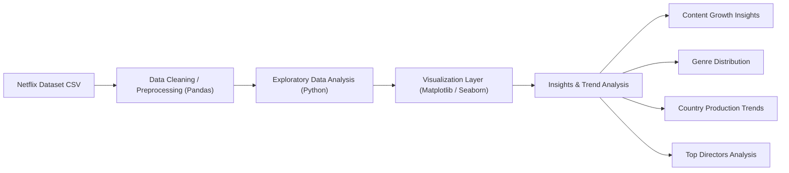

# Netflix Analysis 


=======
- Analyze the growth of Netflix content over the years
- Compare Movies vs TV Shows distribution
- Identify the most common genres
- Discover top contributing countries
- Find directors with the most titles
- Explore the distribution of content ratings

---

# Project Overview

- Python
- Pandas
- Matplotlib
- Seaborn
- Jupyter Notebook

---

The analysis focuses on understanding:

- How Netflix expanded its content library over time  
- The distribution of Movies vs TV Shows  
- The most popular genres on Netflix  
- Countries producing the most Netflix content  
- Directors contributing the most titles  

Using **Python, Pandas, Matplotlib, and Seaborn**, this project demonstrates how exploratory data analysis can transform raw datasets into meaningful insights.

---

# Key Takeaways

- Netflix content growth accelerated sharply after 2015, with the strongest expansion occurring between 2016 and 2019.
- Movies make up a significantly larger share of the catalog than TV Shows.
- International Movies and Dramas are among the most represented genres, showing strong demand for broad audience appeal.
- The United States contributes the highest number of titles, followed by India and the United Kingdom.
- A relatively small set of directors appears multiple times, suggesting recurring creator partnerships.
- Ratings trends indicate that much of the catalog is targeted toward mainstream and mature audiences.

---

# Why This Analysis Matters

Streaming platforms generate massive content datasets that can reveal strategic patterns when analyzed effectively. This project demonstrates how data analysis can be used to:

Track platform growth over time
Compare the balance between Movies and TV Shows
Identify dominant genres in the catalog
Understand which countries contribute the most content
Discover repeat contributors such as directors
Interpret how Netflix positions content for different audience groups

---

# Project Objectives

- Analyze the growth of Netflix content over the years
- Compare Movies vs TV Shows distribution
- Identify the most common genres
- Discover top contributing countries
- Find directors with the most titles
- Explore the distribution of content ratings

---

# Tools & Libraries

- Python  
- Pandas  
- Matplotlib  
- Seaborn  
- Jupyter Notebook  

---

# Dataset

**Dataset:** Netflix Movies & TV Shows Dataset  
**Source:** [Kaggle - Netflix Shows Dataset](https://www.kaggle.com/datasets/shivamb/netflix-shows)

Source:  
https://www.kaggle.com/datasets/shivamb/netflix-shows
=======
Key fields used in the analysis:

- `type`
- `title`
- `director`
- `country`
- `listed_in`
- `rating`
- `release_year`
- `date_added`

---

## Data Preparation & Methods

The dataset was cleaned and processed using Pandas before analysis. Main preparation steps included:

- Removing or handling missing values in important columns
- Converting date fields into usable datetime format
- Standardizing categorical fields for cleaner grouping
- Aggregating title counts by year, genre, country, rating, and director
- Building comparative visualizations using Matplotlib and Seaborn

This workflow helped transform the raw dataset into a structure suitable for exploratory analysis and insight generation.

---

## Visual Insights

Key fields used in the analysis:

- show_id
- type
- title
- cast
- director
- country
- listed_in
- rating
- release_year
- date_added
- duration

---

## Data Preparation & Methods

The dataset was cleaned and processed using Pandas:

• Removed missing or inconsistent values  
• Converted date fields for time-based analysis  
• Aggregated titles by year to analyze growth trends  
• Grouped genres and countries to identify dominant categories  
• Generated visualizations using Matplotlib and Seaborn

---

# Key Insights

## Content Growth on Netflix


Netflix's catalog expanded rapidly after 2015, peaking around 2019 before showing a mild decline in later years.

---

## Movies vs TV Shows Distribution


Movies clearly dominate the Netflix catalog, indicating that film content still makes up the majority of titles on the platform.

---

## Top Genres on Netflix


International Movies, Dramas, and Comedies appear most frequently, highlighting Netflix's focus on broadly appealing, high-volume categories.

---

## Top Countries Producing Netflix Content


The United States leads by a large margin, while India and the United Kingdom also contribute substantial volumes of content.


---

## Top Directors on Netflix
=======
### Top Directors on Netflix


Several directors appear repeatedly in the dataset, suggesting ongoing content partnerships and recurring creative contributions.

### Ratings Distribution


Ratings analysis provides an additional view into audience targeting and how Netflix balances family, teen, and mature content.

---

## Data Analytics Pipeline

`Dataset -> Data Cleaning -> Exploratory Analysis -> Visualization -> Insights`

---

## Key Business Questions Answered

- How has Netflix expanded its content library over time?
- Are Movies or TV Shows more dominant on the platform?
- Which genres appear most frequently in the catalog?
- Which countries contribute the most Netflix content?
- Which directors have the highest number of titles?
- What does the ratings distribution suggest about audience targeting?

---

## What You Can Learn From This Project

- How to clean and explore a real-world dataset using Pandas
- How to create clear analytical visualizations with Matplotlib and Seaborn
- How to translate charts into portfolio-ready insights
- How to structure a complete exploratory data analysis project for GitHub

---

## Quick Start

### Prerequisites

- Python 3.10+
- Jupyter Notebook

Install the required libraries:

```bash
pip install pandas matplotlib seaborn notebook
```

### Clone the Repository

```bash
git clone https://github.com/bindhusaahithi/Netflix-Analysis.git
cd Netflix-Analysis
```

### Run the Analysis

Open the notebook:

```bash
jupyter notebook Notebook/Netflix_Analysis.ipynb
```

Run all cells to reproduce the analysis and charts.

---

---

# Data Analytics Pipeline

The project follows a simple data analytics workflow.

Dataset → Data Cleaning → Exploratory Analysis → Visualization → Insights

---

# Architecture



---

# What You Can Do With This Project

### Content Trend Analysis

- Analyze Netflix content growth across years  
- Identify expansion patterns in the streaming platform

### Genre Analysis

- Discover dominant genres on Netflix  
- Explore content category distributions

### Geographic Analysis

- Identify which countries contribute the most titles  
- Analyze global production patterns

### Creator Analysis

- Identify directors producing the most Netflix content

---

# Quick Start

## Prerequisites

Python 3.8+

Install required libraries:

pip install pandas matplotlib seaborn

---

## Clone Repository

git clone https://github.com/bindhusaahithi/Netflix-Analysis.git

cd Netflix-Analysis

---

## Run the Analysis

Open the notebook:

jupyter notebook Netflix_Analysis.ipynb

Run all cells to reproduce the analysis and visualizations.

---

# Project Structure


Netflix-Analysis

├── data  
│   └── netflix_titles.csv  

├── notebooks  
│   └── Netflix_Analysis.ipynb  

├── visuals  
│   ├── content_growth.png  
│   ├── movies_vs_tvshows.png  
│   ├── top_genres.png  
│   ├── top_countries.png  
│   └── top_directors.png  

=======
```text
Netflix-Analysis/
├── Data/
│   └── netflix_titles.csv
├── Notebook/
│   └── Netflix_Analysis.ipynb
├── visuals/
│   ├── content_growth.png
│   ├── movies_vs_tvshows.png
│   ├── top_countries.png
│   ├── top_directors.png
│   ├── top_genres.png
│   └── top_ratings.png
├── index.html
├── style.css
>>>>>>> 1957593 (Add portfolio homepage)
└── README.md
```

---


# Future Improvements

Build an interactive dashboard using Streamlit or Power BI
Add deeper analysis by release year and country-genre combinations
Perform sentiment analysis on Netflix reviews or descriptions
Train a recommendation or classification model on content metadata
Compare Netflix patterns with other streaming platforms

---

# Final Conclusion
=======
## Future Improvements

- Build an interactive dashboard using Streamlit or Power BI
- Add deeper analysis by release year and country-genre combinations
- Perform sentiment analysis on Netflix reviews or descriptions
- Train a recommendation or classification model on content metadata
- Compare Netflix patterns with other streaming platforms

---

## Final Conclusion

This analysis shows that Netflix's catalog growth was especially aggressive in the late 2010s, with Movies remaining the dominant content type. The platform also reflects strong international breadth, with major contributions from the United States, India, and the United Kingdom. Overall, the findings highlight how exploratory data analysis can reveal meaningful patterns in content strategy, audience targeting, and global production trends.

---

# Author

Bindhu Saahithi  

Master's in Data Science  

GitHub: https://github.com/bindhusaahithi

=======
## Author

**Bindhu Saahithi**  
Master's in Data Science

GitHub: [bindhusaahithi](https://github.com/bindhusaahithi)

